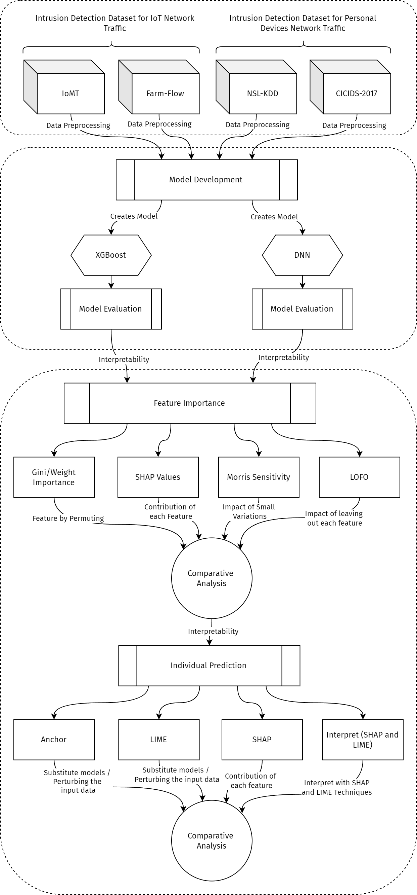

# Explainable AI (XAI) for Cybersecurity: Intrusion Detection System (IDS)

## Introduction

The increasing use of Machine Learning models in Cybersecurity applications has raised concerns about their interpretability and transparency. This research project aims to develop explainable Machine Learning-Based Intrusion Detection System (IDS) models and improve their performance.

## Project Summary

  

This research project, funded by FCT - Foundation for Science and Technology UIDB/04524/2020, is developed by CIIC - Computer Science and Communication Research Centre - Polytechnic of Leiria, and led by [Ivo Bispo](https://github.com/ivoafonsobispo).

# Repository Structure

- **Datasets:** 
  - Contains the datasets used for creating the Machine Learning IDS models. 
- **Pre-Modeling Phase:** 
  - Includes notebooks and scripts for the pre-modeling phase.
  - **Exploratory Data Analysis (EDA):** Notebooks for initial data exploration and visualization.
  - **Feature Understanding:** Scripts for analyzing and understanding the features in the datasets.
  - **Feature Engineering:** Notebooks for creating new features or modifying existing ones to improve model performance.
  - **Pre-Processing:** Scripts for data cleaning, normalization, and preparation before modeling.
- **Modeling Phase:** 
  - Contains scripts and notebooks for the modeling phase.
  - **Model Creation:** Scripts for training various Machine Learning models.
  - **Model Evaluation:** Notebooks for assessing the performance of different models.
  - **Model Saving:** Scripts for saving the trained models for future use.
- **Explainable Phase:**
  - Includes notebooks with explainability libraries and tools.
  - **Feature Importance:** Notebooks for determining the importance of each feature in the models.
  - **Individual Predictions:** Tools for explaining specific predictions made by the models.
  - **Other Libraries:** Additional libraries and methods for enhancing the interpretability of the models.

## Experimental Workflow

## Getting Involved

- **Contributing:** Contact the authors with questions or contributions: Ivo Bispo (`ivoafobispo@gmail.com`).
